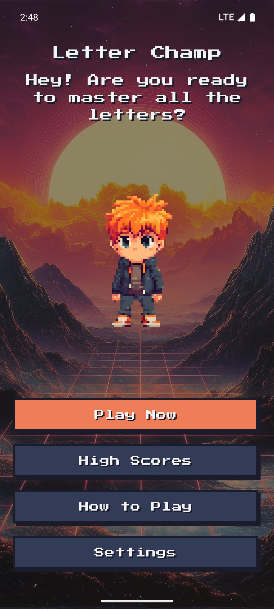
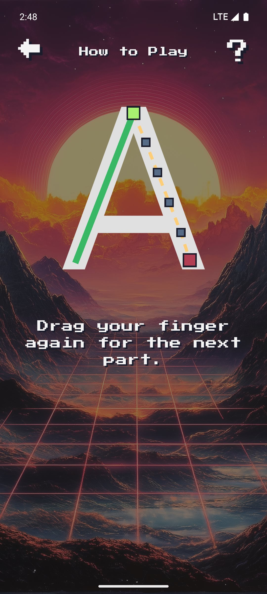
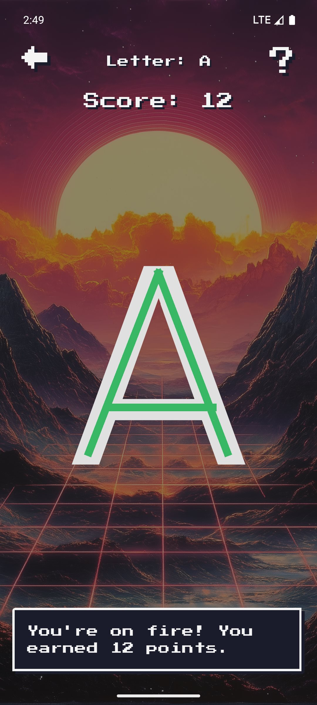

# Letter Champ

**Every stroke counts.**

Letter Champ is a Flutter game for tracing letters and numbers, with a retro look and support for English and Swedish. Follow the stroke guides, build a streak, and try to beat your personal best.

The game plays offline. Settings, high scores, and your longest streak are saved on your device; no account is required.

Letter Champ started as a small project for my son, to help him practice drawing letters in the right order and direction. It is a hobby project with no commercial plans, shared here in case it helps another child, or another parent learning Flutter.

## Screenshots

<table>
  <tr>
    <td align="center"></td>
    <td align="center"></td>
    <td align="center"></td>
  </tr>
  <tr>
    <td align="center">Main menu</td>
    <td align="center">Guided practice</td>
    <td align="center">Tracing and scoring</td>
  </tr>
</table>

Screenshots are from the September 2026 version on an Android 15 emulator. [View all screenshots](assets/screenshots).

## Features

- **Letters and numbers:** practice uppercase, lowercase, or mixed-case letters, with optional digits from 0 to 9.
- **English and Swedish:** switch the interface language and practice Swedish letters Å, Ä, and Ö.
- **Your choice of order:** work through the alphabet or shuffle the characters.
- **Stroke guidance:** learn through an animated tutorial and request hints during play.
- **Scores and streaks:** earn bonuses for consecutive correct letters and track your personal records.
- **Music and sound effects:** turn each on or off independently.
- **Retro look:** a pixel font with hard shadows, flat outlined buttons and a 16-color pixel-art palette, all snapped to the device's pixel grid.

## How to play

1. Open **Settings** to choose a language, which letters to practice (uppercase, lowercase or both), the order, and whether to include numbers. The default language is English.
2. Try **How to Play** for a guided introduction, or choose **Play Now** to start tracing.
3. Draw each letter in the expected stroke order and direction. Correct letters earn points; an incorrect stroke costs 2 points and resets your streak.
4. Tap the question mark when you need a guide. The first hint in each game is free; later hints cost 5 points when you have enough points.

## Get the app

**Android:** download the newest `letterchamp-<version>.apk` from the [Releases page](https://github.com/goodjobswe/letterchamp/releases) and open it on the phone. Android asks once to allow installs from that source. Each release also carries a `.sha256` checksum. The app is not on Google Play.

**iOS:** no build is published. The native project is included, but it has not been built yet; see the [development guide](docs/DEVELOPMENT.md).

Or build from source as described below.

## Run locally

The current tested baseline is **Flutter 3.29.3 / Dart 3.7.2**. Dart is included with Flutter. Packages are kept at the newest versions that resolve on this SDK; a newer Flutter and the major package upgrades that depend on it are tracked in the project review.

For Android, install the Flutter SDK, Android SDK tools, and a compatible Java JDK, then start an Android emulator or connect a phone with USB debugging enabled. VS Code with the Flutter extension can handle editing, running, debugging, and hot reload.

```sh
git clone https://github.com/goodjobswe/letterchamp.git
cd letterchamp
flutter doctor -v
flutter pub get
flutter devices
```

Run on the Android device listed by `flutter devices`, replacing `ANDROID_DEVICE_ID` with its ID:

```sh
flutter run -d ANDROID_DEVICE_ID
```

In VS Code, open the project folder, select your Android device, and press **F5** using the included **Letterchamp** launch configuration.

See the [development guide](docs/DEVELOPMENT.md) for emulator setup, using the Android tools without Android Studio, and iOS requirements.

## Project status

Letter Champ was revived in September 2026 after a development pause. The build was restored, the interface got a retro redesign, every English and Swedish string was reviewed, and the lifecycle and input issues found in the review were fixed. The baseline passes static analysis and the automated tests, and the debug build has been exercised on an Android 15 / API 35 emulator through every screen, including tracing letters in the tutorial and the game.

| Platform | Status |
| --- | --- |
| Android | Debug build verified on an emulator through all screens. Physical-device testing and release signing remain. |
| iOS | Native project included; build and runtime testing still needed on a Mac with Xcode. |
| Web and desktop | No app runners included. |

The next work covers a newer Flutter baseline with the major package upgrades, widget tests for gameplay, release signing, and iOS verification. The [project review](docs/PROJECT_REVIEW.md) documents the findings and what is still open.

## Development

Run the checks with:

```sh
dart format --output=none --set-exit-if-changed lib/main.dart lib/screens lib/services lib/theme lib/models test
flutter analyze
flutter test
```

The same checks and a debug APK build run in GitHub Actions for every push and pull request. The tests cover settings defaults and persistence, score resets, tracing-data coverage, and loading bundled fonts without network access. They do not yet cover complete gameplay flows.

The main parts of the code are:

- `lib/screens/` — menus, settings, gameplay, and the tutorial.
- `lib/widgets/` — the surface letters are traced on, shared by the game and the tutorial, and the animated mascot.
- `lib/theme/` — the palette, pixel-font text styles, and the retro widgets every screen is built from.
- `lib/data/` — ordered tracing checkpoints for each character, and the tool used to author them.
- `lib/models/` — the checkpoint model, stroke validation, and the scoring rules.
- `lib/services/` — saved settings and records, music, and sound effects.
- `android/` and `ios/` — native app projects.

See the [development guide](docs/DEVELOPMENT.md) for the emulator, code style, and CI details.

## Contributing

Issues and pull requests are welcome. For a bug report, include the device and OS, Flutter version, steps to reproduce, and the expected and actual behavior. Screenshots are helpful for layout or tracing issues. For a pull request, run the checks above first and keep the app text in both English and Swedish.

## Credits

Credit: https://www.FesliyanStudios.com Background Music. The background music is used under Fesliyan Studios' free license, which requires this credit and does not allow monetized use. The sound effects most likely come from the same site, but their source was not recorded when they were added, so that cannot be stated with certainty.

The fonts are Press Start 2P and Poppins under the Open Font License; their notices are listed in [assets/fonts](assets/fonts/README.md).

## License

The source code is released under the [MIT License](LICENSE), so anyone can learn from it or build on it. The license covers the code only: the character, background artwork, sound effects and music are not included and may not be reused or redistributed outside this project without permission from their respective owners.
